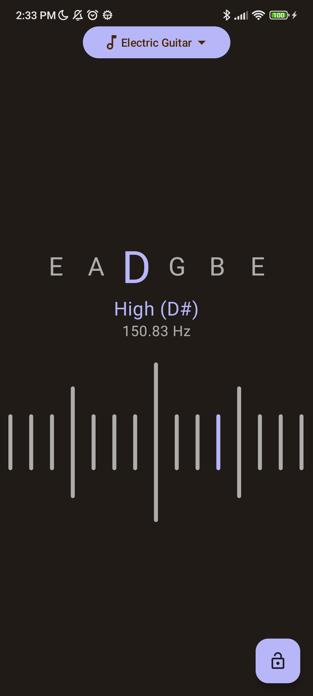

# Tuner
A tuner is a device that detects a note's pitch when played on a musical instrument.

# Screenshot

    

# Credits
- [Design based on the Figma Community](https://www.figma.com/file/ZoN7fQ00wyyJi3K0ed8MsH/Stay-Tuned!-(Community)?node-id=115-51&t=NsurW5nkPGMd1hQV-0)